<p align="center">
  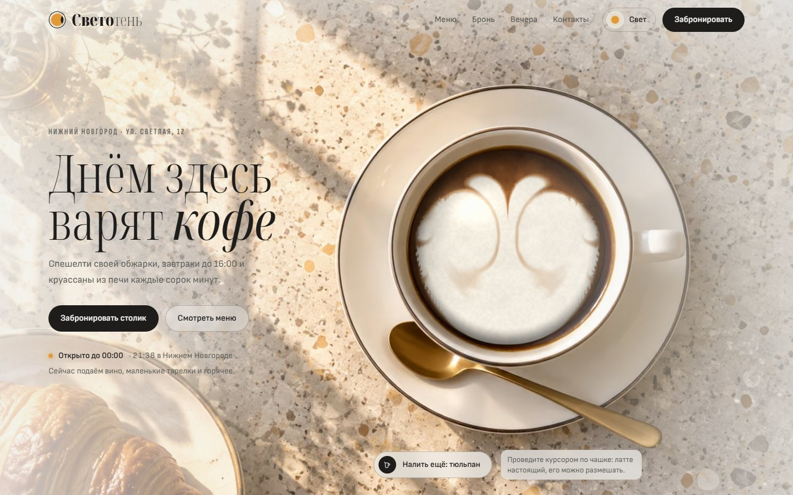
</p>

# «Светотень» — кофейня днём, бистро вечером

> Сайт вымышленной кофейни-бистро в Нижнем Новгороде, который живёт по часам заведения: днём он залит солнечным светом, а в 18:00 переходит в вечерний режим при свечах. Под атмосферной витриной — рабочая бронь столиков на плане зала и панель владельца.


**Главное:**

- **Живой латте на WebGL2.** На главном экране — собственная симуляция жидкости: чашку на фотографии можно размешать курсором или пальцем, бариста наливает сердце, тюльпан или розетту, а вечером та же жидкость становится вином в бокале.
- **Сайт по часам кофейни.** Дневной или вечерний режим выбирается до первой отрисовки, без мигания; при ручном переключении новый свет расходится кругом от кнопки, а меню устроено как один день — с полосой заката, где темнеет страница и зажигается свеча.
- **Настоящая бронь.** План зала из 17 столов в шести зонах, слоты по 30 минут, защита от двойной брони на уровне базы данных, билет с `.ics` и отменой, опциональное уведомление в Telegram, панель владельца с таймлайном дня и стоп-листом.

## Идея

Название и есть концепция. Светотень — живописный приём, построенный на контрасте света и тени. Утренняя кофейня и вечернее бистро — это одни и те же столы, меняется только свет. Сайт повторяет это буквально: он следует часам кофейни (московское время, UTC+3, независимо от часового пояса посетителя), с 07:00 до 18:00 показывает день — тёплый свет из окна и холодные голубоватые тени, — а после 18:00 переходит в вечер: графитовая темнота, свечи, вино.

Метафора проведена через все детали. Логотип — чашка, увиденная сверху, и одновременно луна: при смене режима тень на ней сдвигается. В словесном знаке «Свето» и «тень» меняются насыщенностью начертания. Кофе в главном кадре превращается в вино, дневные и вечерние фотографии сняты парами с одного ракурса, а меню читается как один день — от первого эспрессо до последнего бокала.

Проект показывает, как выразительный фронтенд (шейдеры, симуляция жидкости, View Transitions, продуманная анимация) уживается с прикладной частью, которой пользовался бы реальный владелец: бронь с проверкой целостности в БД, статусы гостей, стоп-лист, уведомления. Он адресован заведениям, которым нужен сайт с характером и онлайн-бронью, и тем, кто оценивает full-stack навыки на Next.js.

## Скриншоты

<table>
  <tr>
    <td width="50%" valign="top">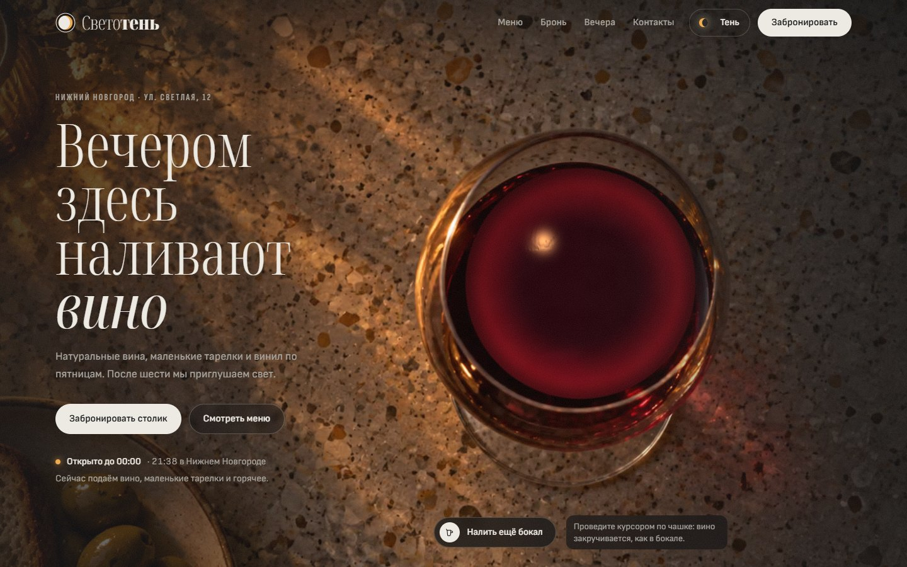<br><sub>Тот же сайт после 18:00</sub></td>
    <td width="50%" valign="top">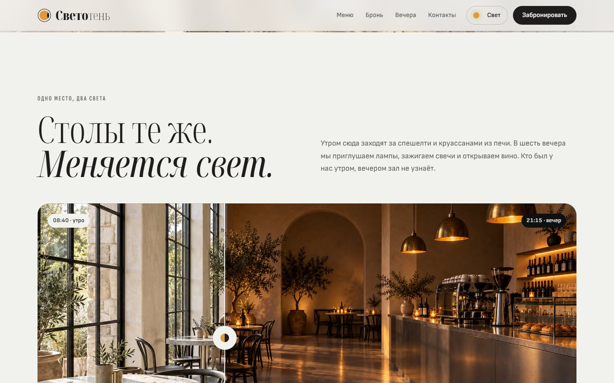<br><sub>Один зал — днём и вечером</sub></td>
  </tr>
  <tr>
    <td width="50%" valign="top">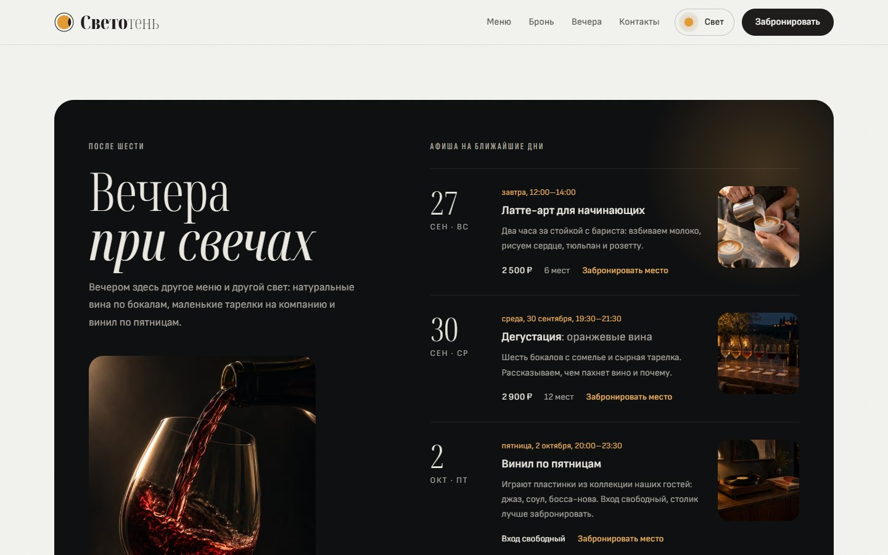<br><sub>Вечера при свечах</sub></td>
    <td width="50%" valign="top">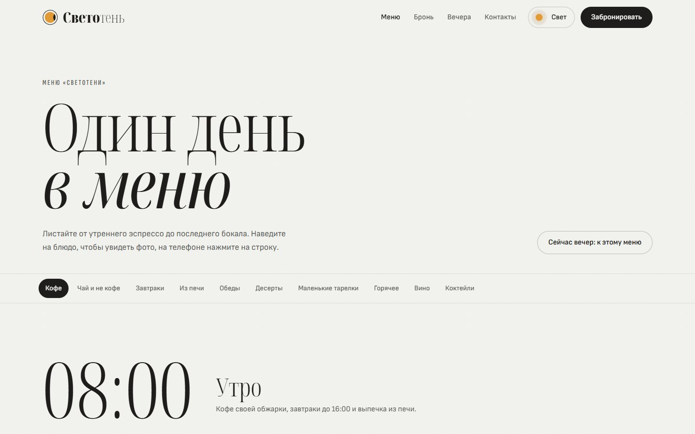<br><sub>Меню как один день</sub></td>
  </tr>
  <tr>
    <td width="50%" valign="top">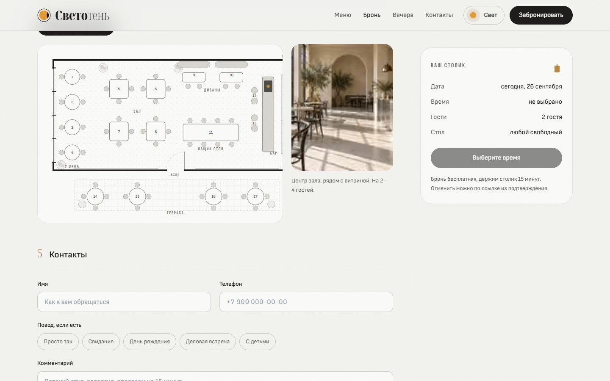<br><sub>Бронь: план зала</sub></td>
    <td width="50%" valign="top">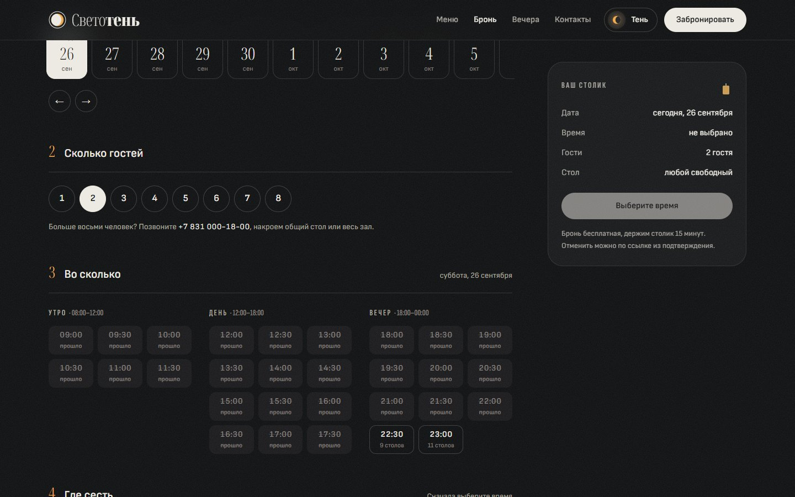<br><sub>Бронь вечером: дата, гости, время</sub></td>
  </tr>
  <tr>
    <td width="50%" valign="top">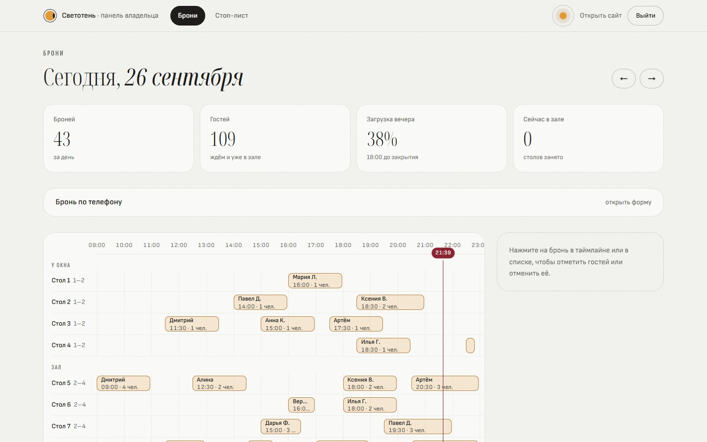<br><sub>Панель владельца: таймлайн дня по столам</sub></td>
    <td width="50%" valign="top">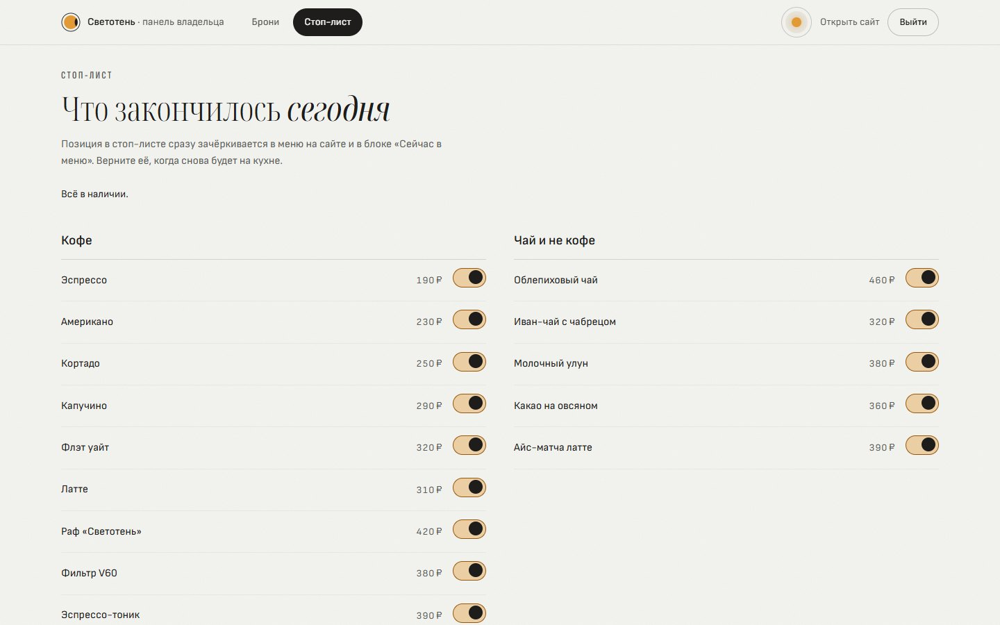<br><sub>Стоп-лист</sub></td>
  </tr>
</table>

<p align="center">
  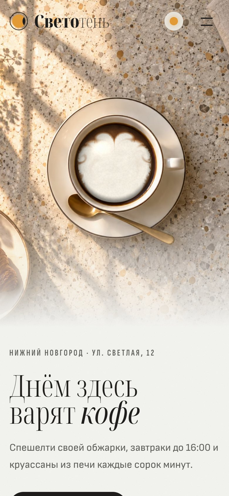
  <br><sub>Мобильная версия</sub>
</p>

## Возможности

### Главная

1. **Герой.** Стол сверху, на нём чашка кофе, поверх жидкости — WebGL-холст. При загрузке бариста наливает сердце, кнопка «Налить ещё» рисует следующий узор по кругу (сердце, тюльпан, розетта), курсор или палец размешивает пену. Вечером вместо чашки — бокал, вино закручивается тем же жестом, кнопка становится «Налить ещё бокал». Рядом — живой статус: «Открыто до 23:00», текущее время в Нижнем Новгороде и что сейчас подают.
2. **«Одно место, два света».** Слайдер «до/после» с одним и тем же залом в 08:40 и 21:15: шов тянется мышью или пальцем, управляется стрелками с клавиатуры, а при первом появлении сам слегка «прогуливается», подсказывая жест. Ниже — таймлайн дня: 08:00, 12:00, 18:00, 00:00.
3. **«Сейчас в меню».** Вкладки «Утро», «День», «Вечер»; открыта та, что соответствует текущему времени, и она переключается сама, если страница открыта на границе частей дня. Четыре блюда с фото и ценой, позиции из стоп-листа помечены «закончилось».
4. **Кофе.** Карточка «зерна недели» с датой последней обжарки (ближайший прошедший вторник вычисляется от текущей даты) и «анатомия напитка»: выбираете один из 10 напитков, и в разрезе чашки или стакана по слоям наливаются эспрессо, молоко, пена, тоник, лёд. Легенда показывает объём каждого слоя и общий объём. Ниже — четыре кадра процесса с подписями.
5. **Вечера при свечах.** Блок всегда тёмный, в каком бы режиме ни был сайт. Афиша ближайших четырёх событий вычисляется из еженедельного расписания в `src/data/events.ts`: винил по пятницам, дегустация по средам (тема меняется по номеру недели), субботний каппинг, воскресный мастер-класс по латте-арту. У каждого — метка «сегодня»/«завтра», время, цена или «Вход свободный» и ссылка на бронь именно этого вечера.
6. **Зал.** План зала: наведение на зону подсвечивает её столы и меняет фото зоны, рядом — вкладки зон, число столов и описание. Терраса сезонная: с октября по апрель она приглушена и подписана «Терраса закрыта до мая».
7. **Как нас найти.** Часы работы с выделенным сегодняшним днём и живой строкой «открыто/закрыто», телефон, нарисованная схема района с пульсирующей меткой и фото фасада.

### Меню — `/menu`

- 57 позиций в 10 категориях разложены на три «акта»: Утро 08:00 (кофе, чай, завтраки, выпечка), День 12:00 (обеды, десерты), Вечер 18:00 (маленькие тарелки, горячее, вино, коктейли). Текущий акт помечен «сейчас подаём», а если сейчас не утро, в шапке появляется кнопка перехода к нему.
- Между днём и вечером — полоса «Смена света» высотой 240vh: пока её прокручиваешь, часы идут с 17:30 до 18:30, солнце уходит, фон темнеет, зажигается свеча, и на середине весь сайт переключается в вечерний режим. Прокрутка назад возвращает день.
- Липкая навигация по категориям подсвечивает раздел, который сейчас на экране.
- На десктопе фото блюда следует за курсором с пружинной инерцией и наклоном по скорости движения; на телефоне фото раскрывается под строкой по нажатию.
- В разделе «Кофе» справа закреплена «анатомия»: наведение на напиток наливает его в разрезе.
- Отметки «Фирменное», «Вегетарианское», «Веганское», «Без глютена», «Острое», «Новое»; две цены там, где есть два объёма или бокал и бутылка. Позиции из стоп-листа зачёркнуты с пометкой «Закончилось сегодня».
- Переключатель «Свет/Тень» на этой странице не меняет режим, а прокручивает к утру или к вечеру.

### Бронь — `/booking`

Пять шагов на одной странице, сводка брони справа (на телефоне — плашка снизу, которая появляется после выбора времени):

1. **Когда** — лента из 30 дней, выходные выделены, точкой помечены дни с событиями. Если в выбранный день есть вечер из афиши, его можно отметить чипом — время подставится само.
2. **Сколько гостей** — от 1 до 8; для компаний больше — телефон.
3. **Во сколько** — слоты с шагом 30 минут, сгруппированные по утру, дню и вечеру. На каждом видно, сколько столов свободно на всю длительность визита, либо «занято», «прошло», «афиша».
4. **Где сесть** — «любой свободный стол» или выбор на плане: подходящие свободные столы подсвечены, занятые заштрихованы, неподходящие по размеру приглушены, на выбранном «зажигается» свеча. Рядом — фото зоны и заметка о столе, например «Угловой диван под лампой».
5. **Контакты** — имя, телефон с автоформатированием, повод, комментарий, согласие на обработку данных.

Визит длится 2 часа (2,5 часа для компаний от пяти человек) и не выходит за время закрытия; последняя посадка — за час до закрытия, онлайн-бронь закрывается за 30 минут до начала. Если стол заняли, пока гость заполнял форму, он получает понятное сообщение, выбор стола сбрасывается, план перезагружается. Ссылка вида `/booking?event=wine-tasting&date=…` из афиши сразу выбирает дату, вечер и время.

### Билет — `/booking/[code]`

- Билет с перфорацией «выезжает», как из принтера: дата, время визита, код брони вида `SV-7K3M9Q`, гости, стол, зона, телефон со скрытой серединой, вечер из афиши и комментарий.
- «Добавить в календарь» отдаёт `.ics` с напоминанием за два часа (`/booking/[code]/calendar`).
- Гость отменяет бронь сам, подтвердив последние четыре цифры телефона, — так её не отменит случайный обладатель ссылки. Отмена возможна до начала визита, стол освобождается сразу.
- У отменённой и прошедшей брони свой вид страницы; страница закрыта от индексации.

### Панель владельца — `/admin`

Вход по паролю. Демо-пароль `svetoten` указан в `.env.example` и на странице входа.

- **Брони на день** с переключением дней и четырьмя метриками: число броней (и сколько пришло с сайта), гости, загрузка вечера в процентах, занятые столы в зале прямо сейчас.
- **Таймлайн:** столы по зонам сверху вниз, часы работы слева направо, брони — полосы, окрашенные по статусу, и линия текущего времени.
- **Список и карточка брони:** время, стол, гость, телефон-ссылка, источник («с сайта», «по телефону», «демо»). В карточке — смена статуса: «Пришли», «Ушли», «Не пришли», «Отменить», «Вернуть в ожидание». Отмена и неявка освобождают стол.
- **Бронь по телефону:** форма с теми же правилами и той же защитой от двойной брони, что и на сайте.
- **Стоп-лист** (`/admin/menu`): переключатель у каждой позиции; позиция сразу зачёркивается в меню и в блоке «Сейчас в меню» на главной.

### Детали

- Переходы между страницами — «пар»: WebGL-шейдер поднимается снизу, закрывает страницу названием следующей и открывает её.
- «Магнитная» кнопка «Забронировать», полноэкранное мобильное меню с адресом и часами.
- Свои страницы 404 («Этого столика у нас нет» с опрокинутой чашкой) и ошибки («Кофемашина задумалась»).
- OG-картинка генерируется через `next/og` с подмножествами шрифтов, иконка — та же чашка-луна.
- Плёночное зерно поверх сайта: днём в режиме наложения `multiply`, вечером — `screen`.

## Как это устроено

### Живой латте на WebGL2

`src/components/home/latte/engine.ts` — класс `LatteEngine`, решатель stable fluids на квадратной сетке, где чашка — вписанный круг. Шейдеры лежат в `shaders.ts`.

- Каждый кадр: завихрённость (curl и vorticity confinement), дивергенция, 20 итераций Якоби для давления, вычитание градиента, адвекция скорости (с гашением у стенки чашки) и поля «молока». Текстуры half-float (`RG16F`, `R16F`), нужно расширение `EXT_color_buffer_float`. Сетка скорости 128×128, поле молока 640×640; на экранах до 820 px — 96 и 384.
- Узоры латте-арта заданы SDF-функциями в `STAMP_FRAG` (сердце, тюльпан, розетта) и «наливаются» фронтом с рваным шумовым краем. Перед новым узором старый размешивается ложкой по кругу.
- `DISPLAY_FRAG` рисует крему с «тигровым» крапом на fbm-шуме, микропену с карамельной каймой, освещение по нормалям из градиента поля, блик окна и мениск у стенки. Вечером то же поле становится вином: рубиновым, светлее у края, со спиральными разводами после «закручивания» бокала; блик переезжает от окна к свече.
- Экономия: симуляция засыпает вне экрана (`IntersectionObserver`), в скрытой вкладке и через 4,5 с бездействия. Шаги анимации идут по накопленному времени кадров, поэтому свёрнутая вкладка продолжает их, а не пропускает. При `prefers-reduced-motion` узор ставится сразу, без WebGL2 показывается статичная SVG-чашка.
- Совмещение с фотографией: для каждого кадра героя (день и вечер, 16:9 и 9:16) в `src/data/hero.ts` замерены центр и радиус жидкости. Эти числа уходят в CSS-переменные, и `globals.css` через единицы контейнера (`cqw`, `cqh`) масштабирует фото так, чтобы круг жидкости встал точно под холст на любой ширине. На самих фотографиях чашка налита чистым чёрным кофе, а бокал — вином с гладкой поверхностью: весь рисунок даёт холст. Пока фото нет, вместо него нарисованная чашка на процедурной текстуре терраццо.

### День и вечер без вспышки

- `src/components/mode/mode-script.ts` — скрипт в `<head>`, который до первой отрисовки ставит `data-mode="day"` или `"night"` на `<html>`: ручной выбор из `localStorage` или режим по времени кофейни.
- Всё, что отличается днём и вечером, рендерится в HTML в обоих вариантах, а классы `.only-day` и `.only-night` показывают нужный. Цвета — CSS-переменные, переопределяемые по `data-mode`. Поэтому серверный HTML не зависит от времени суток и часового пояса, и гидрация не расходится.
- `ModeProvider` раз в минуту сверяется с часами. Ручной выбор хранится до ближайшей естественной смены (07:00 или 18:00), после неё сайт снова следует часам.
- Смена режима идёт через View Transitions API: по нажатию новый свет расходится кругом от переключателя (`clip-path` на `::view-transition-new(root)`), автоматическая смена мягко растворяется. Страница меню может временно навязать режим (`force`) и перехватить переключатель (`overrideToggle`).
- Вся арифметика дат — в `src/lib/time.ts` с фиксированным смещением UTC+3 (`cafeParts`, `cafeInstant`, `cafeDateKey`): часы работы, слоты и афиша одинаковы для сервера в любом часовом поясе и для любого посетителя.

### Слоты и защита от двойной брони

Бронь занимает стол на несколько 30-минутных слотов, и каждый слот — отдельная строка `BookingSlot` с уникальным индексом по паре «стол + слот» (`prisma/schema.prisma`):

```prisma
model BookingSlot {
  id        String      @id @default(cuid())
  bookingId String
  booking   Booking     @relation(fields: [bookingId], references: [id], onDelete: Cascade)
  tableId   String
  table     DiningTable @relation(fields: [tableId], references: [id])
  slot      DateTime

  @@unique([tableId, slot])
  @@index([slot])
}
```

- `createBooking` в `src/lib/booking.ts` проверяет дату, время и срок, отбирает подходящие свободные столы и создаёт `Booking` вместе со всеми слотами одной вложенной записью. Если двое одновременно берут один стол, вторая запись падает с ошибкой уникальности `P2002`: для выбранного стола это ответ 409 «Этот столик только что заняли», для «любого стола» — попытка со следующим кандидатом (до трёх).
- «Любой стол» выбирает `rankTables`: самый маленький из подходящих, затем по предпочтению зон — окно, зал, диваны, бар, общий стол, терраса.
- Отмена и неявка удаляют слоты в транзакции: стол освобождается, а бронь остаётся в истории.
- Правила из `src/lib/booking-rules.ts` не обращаются к базе и используются и сервером, и клиентом. Входные данные проверяет zod-схема `bookingInput` из `src/lib/validation.ts`, телефон нормализуется к виду `7XXXXXXXXXX`.

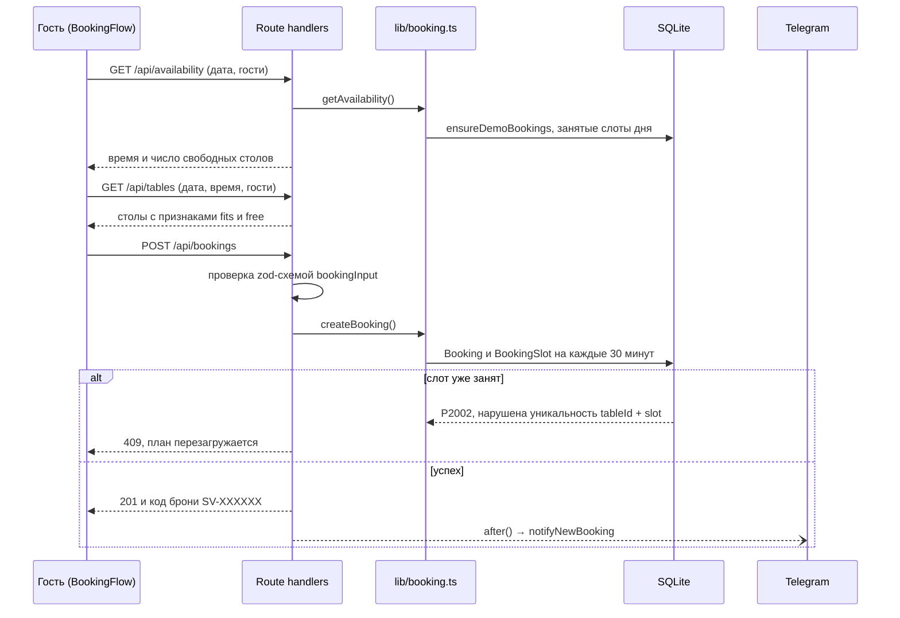

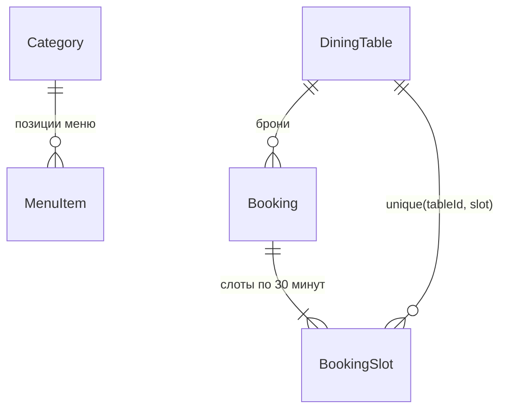

Схема не использует возможностей, специфичных для SQLite: для PostgreSQL достаточно сменить провайдер в `schema.prisma` и адаптер в `src/lib/prisma.ts`.

### Демо-брони

`src/lib/demo.ts`: при `DEMO_BOOKINGS="true"` каждый день от вчерашнего до тринадцатого вперёд при первом обращении заполняется правдоподобными бронями, чтобы план зала и панель не выглядели пустыми. Генератор детерминированный: зерно ГПСЧ — хеш даты, поэтому один и тот же день всегда выглядит одинаково. Вечером брони чаще, чем днём, а в пятницу и субботу — ещё чаще. Статусы соответствуют моменту: прошедшие — «Ушли» или изредка «Не пришли», идущие — «В зале», будущие — «Ждём» или изредка «Отменена». Демо-брони пишутся в те же таблицы через те же уникальные слоты и помечены `source: "demo"` и кодом `DM-…`.

### Панель владельца и уведомления

- Сессия — cookie `sv_admin` вида `срок.подпись`, где подпись — HMAC-SHA256 от срока на ключе `ADMIN_SECRET` (`src/lib/auth.ts`). Пароль и подпись сравниваются через `timingSafeEqual`, сессия живёт 12 часов, cookie `httpOnly`, `sameSite=lax`, в продакшене `secure`. Ни таблицы сессий, ни сторонних библиотек.
- Изменения данных — server actions в `src/app/admin/actions.ts` (`updateStatus`, `toggleStock`, `createPhoneBooking`): каждая начинается с `requireAdmin()` и заканчивается `revalidatePath`.
- Уведомление о новой брони уходит в Telegram после ответа гостю — через `after()` из `next/server`, с таймаутом 5 секунд (`src/lib/telegram.ts`). Если токен не задан или Telegram недоступен, бронь от этого не страдает.

### Фотографии: от промпта до кадра

- Источник — [`docs/shot-list.json`](docs/shot-list.json): 66 кадров в 10 разделах с приоритетами (A — каркас сайта, B — хиты меню, C — расширение), общей «библией стиля» и схемой света для дня и вечера. Вечерние пары делаются редактированием дневного кадра, чтобы совпал ракурс.
- `npm run shotlist` собирает из него [`docs/PHOTO_PROMPTS.md`](docs/PHOTO_PROMPTS.md) (промпт на каждый кадр), [`docs/BATCH_PROMPTS.md`](docs/BATCH_PROMPTS.md) (три прохода для чат-модели генерации изображений), [`docs/shot-list.html`](docs/shot-list.html) (страница для просмотра в браузере) и `src/data/shot-meta.ts`.
- Сгенерированные файлы кладутся в `photos-raw/` под именами кадров, после чего `npm run photos` (`scripts/process-photos.mjs`, sharp) обрезает их по центру до пропорции кадра, уменьшает (широкие — до 2880 px, остальные — до 2000 px; слишком мелкие широкие увеличивает с повышением резкости), сжимает mozjpeg и пересобирает `src/data/photo-manifest.json` с 16-пиксельными blur-плейсхолдерами. В конце скрипт печатает, каких кадров не хватает, по приоритетам.
- Каждое фото на сайте проходит через `MediaFrame`: пока кадра нет, на его месте «световой этюд» — свет этого кадра, нарисованный на CSS, с ожидаемым именем файла. Сайт полностью работает без фотографий.
- Сейчас в `public/photos/` все 66 кадров. Если после замены фото героя чашка оказалась не точно по центру, поправьте положение жидкости в `src/data/hero.ts`.

## Дизайн

### Палитра

Токены лежат в `src/app/globals.css` как RGB-тройки, Tailwind читает их через `rgb(var(--token) / <alpha-value>)`, поэтому работают модификаторы прозрачности вроде `border-line/10`. Принцип дня — тёплый свет и холодные тени (`--shadow: #283444`). Секция может держать свой свет независимо от режима: `.tone-night` у вечернего блока, `.tone-day` у билета.

| Токен | День («Свет») | Вечер («Тень») | Роль |
| --- | --- | --- | --- |
| `paper` | `#F3F3F0` фарфор | `#0F1011` уголь | фон |
| `surface` | `#FBFBF9` | `#18191B` | карточки, поля ввода |
| `sunk` | `#E8E7E2` | `#212224` | утопленные поверхности, скелетоны |
| `stone` | `#D8D6D0` терраццо | `#3A3B3D` дым | стулья и стойка на плане |
| `ink` | `#1E1D1B` графит | `#ECE9E2` | основной текст |
| `ink-2` / `ink-3` | `#5C5D59` / `#6E6F6A` | `#A8A59E` / `#807E79` | вторичный текст |
| `honey` | `#E39B35` солнце | `#F0A84A` свеча | акцент, свободные столы |
| `honey-ink` | `#9A580C` | `#F2B25E` | акцентный текст, кольцо фокуса |
| `wine` | `#8C2433` | `#C45A68` | ошибки, стоп-лист |
| `brass` | `#B8893E` | `#C79A52` | латунь, подсвечник |
| `zinc` | `#A7ABAD` | `#606366` | цинк, река на схеме |

### Типографика

- **Noto Serif Display** — заголовки. Вариативный шрифт с осью ширины: `wdth` 62.5 даёт узкое начертание, курсив выделяет акцентные слова («Меняется *свет*»). В логотипе насыщенности 820 и 170 меняются местами при смене режима: днём тяжёлое «Свето», вечером — «тень».
- **Sofia Sans** — основной текст, 17 px, межстрочный интервал 1.55.
- **Sofia Sans Extra Condensed** — надзаголовки и подписи: прописные, разрядка 0.16em.
- Системный моноширинный — коды брони.
- Заголовки `d-1`…`d-4` масштабируются через `clamp()`, цифры — табличные (`tabular-nums`), у заголовков `text-wrap: balance`, у абзацев `pretty`.

### Сетка и движение

- Контейнер до 1360 px с полями `clamp(16px, 4vw, 48px)`, брейкпоинты 560, 820, 1100 и 1360 px. Крупные скругления 20–32 px, тонкие линии с прозрачностью 10–20 %.
- Единая кривая `cubic-bezier(0.16, 1, 0.3, 1)` (`ease-silk`). Появление блоков (`Reveal`) — прозрачность, сдвиг на 28 px и размытие 8 px, один раз при 30 % видимости.
- Плавный скролл Lenis, переходы «пар», круг света при смене режима, наливание напитков в разрезе, «печать» билета, мерцание свечей.

### Адаптивность

- Герой: вертикальное фото 9:16 на телефонах и широкое 16:9 с 1100 px (`<picture>` через `getImageProps`). На телефоне сцена занимает 66svh, кнопка «Налить ещё» уходит под текст, подсказка меняется на «Проведите пальцем».
- На экранах до 820 px симуляция облегчена, `devicePixelRatio` холста ограничен двумя.
- Меню: фото по нажатию вместо следования за курсором, анатомия кофе — карточкой над списком.
- Бронь: план зала прокручивается горизонтально, под ним — чипы свободных столов, нижняя плашка учитывает `safe-area-inset-bottom`.
- Эффекты, завязанные на курсор (фото за курсором, магнитная кнопка), включаются только при `pointer: fine`.

### Доступность

- `prefers-reduced-motion`: глобально гасятся CSS-анимации и переходы, отключаются View Transitions и «пар», латте рисуется сразу, выключаются фото за курсором, магнитная кнопка, появление блоков, подсказка слайдера, «печать» билета и наливание напитков.
- Клавиатура: ссылка «Перейти к содержанию», видимый медовый фокус (`:focus-visible`), столы на плане — `role="button"` с Enter и пробелом и описанием вроде «Стол 9, диваны, на 2–4 гостя, свободен», слайдер «день/вечер» продублирован скрытым `input type="range"`.
- ARIA: `tablist` для частей дня и зон, `radiogroup` для числа гостей и напитков, `role="switch"` в стоп-листе, `aria-live` для статуса «открыто/закрыто» и сведений о столе, `aria-invalid` и `aria-describedby` в форме брони, скрытые подписи у переключателя режима.
- Нажимаемые элементы — от 40 до 48 px, `lang="ru"`, у фотографий осмысленные `alt`, декоративные слои скрыты от скринридеров.

## Стек

| Технология | Версия | Для чего |
| --- | --- | --- |
| Next.js (App Router, Turbopack) | 16.3.6 | серверные компоненты, route handlers, server actions, `next/image`, `next/og`, `after()` |
| React | 19.3.0 | интерфейс, `useActionState` в формах панели |
| TypeScript | 5.9.3 | строгая типизация |
| Tailwind CSS | 3.4.19 | стили на токенах дня и вечера |
| framer-motion | 13.4.4 | появление блоков, пружины, скролл-анимация заката, наливание напитков |
| Lenis | 1.3.26 | плавный скролл |
| WebGL2, GLSL ES 3.0 | — | симуляция латте; WebGL1 — переход «пар» |
| Prisma ORM | 7.10.0 | схема, миграции, клиент (генератор `prisma-client`) |
| SQLite, `@prisma/adapter-better-sqlite3` | 7.10.0 | база данных |
| zod | 4.6.5 | валидация брони, запросов API и форм панели |
| sharp | 0.35.4 | обработка фотографий, генерация текстуры терраццо |
| clsx | 2.1.1 | сборка классов |
| tsx, dotenv | 4.23.15, 18.0.3 | запуск сида, переменные окружения для Prisma |
| `next/font` (Google Fonts) | — | Noto Serif Display, Sofia Sans, Sofia Sans Extra Condensed |

## Структура проекта

```
svetoten-cafe/
├── docs/                         # shot-list.json и собранные из него промпты для фотографий
├── photos-raw/                   # исходники фото (в git только README)
├── prisma/
│   ├── schema.prisma             # Category, MenuItem, DiningTable, Booking, BookingSlot
│   ├── migrations/               # начальная миграция
│   └── seed.ts                   # upsert меню и плана зала из src/data
├── public/
│   ├── photos/                   # 66 обработанных кадров
│   └── textures/terrazzo.webp    # процедурная текстура стола для запасного героя
├── scripts/
│   ├── process-photos.mjs        # кроп, ресайз, blur-плейсхолдеры, манифест
│   ├── build-shotlist.mjs        # PHOTO_PROMPTS.md, shot-list.html, shot-meta.ts
│   ├── build-batch-prompts.mjs   # BATCH_PROMPTS.md: три прохода по приоритетам
│   └── make-textures.mjs         # генерация terrazzo.webp
├── src/
│   ├── app/
│   │   ├── (site)/               # /, /menu, /booking, /booking/[code], .ics
│   │   ├── admin/                # /admin, /admin/menu, /admin/login, server actions
│   │   ├── api/                  # availability, tables, bookings, bookings/[code]/cancel
│   │   ├── opengraph-image.tsx   # OG-картинка через next/og
│   │   └── globals.css           # токены дня и вечера, герой, план зала, билет
│   ├── components/
│   │   ├── home/latte/           # LatteEngine и GLSL-шейдеры
│   │   ├── mode/                 # mode-script, ModeProvider, ModeToggle
│   │   ├── transition/           # SteamVeil, TransitionProvider, TransitionLink
│   │   ├── booking/  hall/       # BookingFlow, билет, отмена, HallPlan
│   │   ├── menu/  coffee/        # MenuDay, DuskInterlude, FloatingPreview, DrinkAnatomy
│   │   └── admin/  layout/  ui/  # панель, шапка и подвал, MediaFrame, Reveal, логотип
│   ├── data/                     # menu.ts, hall.ts, events.ts, hero.ts, photo-manifest.json
│   └── lib/                      # booking, booking-rules, demo, auth, telegram, time, cafe, validation
├── start.bat                     # запуск в один клик на Windows
└── tailwind.config.ts            # цвета-токены, шрифты, шкала заголовков, брейкпоинты
```

## Запуск

Нужны Node.js 20.9 или новее (`engines` в `package.json`) и npm.

**Windows:** двойной клик по `start.bat`. Скрипт поставит зависимости, скопирует `.env.example` в `.env`, создаст базу с меню и планом зала, откроет http://localhost:3100 и запустит dev-сервер.

**Вручную:**

```bash
npm install                  # postinstall сгенерирует Prisma Client в src/generated/prisma
cp .env.example .env         # в Windows: copy .env.example .env
npx prisma migrate deploy    # эти две команды можно заменить на npm run setup
npx prisma db seed
npm run dev -- --port 3100
```

Сайт — http://localhost:3100, панель владельца — http://localhost:3100/admin.

### Переменные окружения

| Переменная | Назначение |
| --- | --- |
| `DATABASE_URL` | путь к SQLite, по умолчанию `file:./prisma/dev.db` |
| `ADMIN_PASSWORD` | пароль панели владельца (в `.env.example` — демо-пароль) |
| `ADMIN_SECRET` | ключ HMAC-подписи cookie сессии; замените длинной случайной строкой |
| `TELEGRAM_BOT_TOKEN` | токен бота; уведомления уходят, только если заданы обе Telegram-переменные |
| `TELEGRAM_CHAT_ID` | чат, куда приходят новые брони |
| `DEMO_BOOKINGS` | `"true"` заполняет ближайшие две недели демо-бронями; для настоящего заведения — `"false"` |
| `SITE_URL` | публичный адрес сайта для превью в соцсетях |

Перед публикацией в открытом доступе смените `ADMIN_PASSWORD` и `ADMIN_SECRET`.

### Скрипты

| Команда | Что делает |
| --- | --- |
| `npm run dev` | dev-сервер |
| `npm run build` / `npm start` | продакшен-сборка и сервер |
| `npm run typecheck` | проверка типов (`tsc --noEmit`) |
| `npm run setup` | применить миграции и засидить базу |
| `npm run db:migrate` | `prisma migrate dev` — новая миграция после правки схемы |
| `npm run db:seed` | upsert меню и плана зала, безопасно запускать повторно |
| `npm run db:reset` | пересоздать базу с нуля |
| `npm run photos` | обработать `photos-raw/` в `public/photos/` и манифест; `npm run photos -- --force` — переобработать всё |
| `npm run shotlist` | пересобрать документы с промптами из `docs/shot-list.json` |
| `node scripts/make-textures.mjs` | заново сгенерировать `public/textures/terrazzo.webp` |

## Дисклеймер

Концепт-проект для портфолио. Кофейня «Светотень», её адрес (ул. Светлая, 12), телефон, меню, цены и афиша вымышлены. Фотографии сгенерированы нейросетью по промптам из `docs/`, схема района нарисована и не является картой, брони в демо-режиме — сгенерированные данные.
